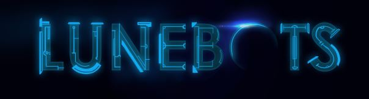

# Luna

It is a Rogue-Like 2D platformer & shooter for PC, Made in Uinty 2019.

## Story
In the future, climate change has massively changed the world that we know today. Areas of the seas have risen, sinking lands beneath the waves and once flourishing forests have turned into deserts with shells of dead trees. Storms rage along the coast, of all types. Snowstorms, thunderstorms, hailstorms, and if you’re unlucky enough, firestorms. Oxygen levels have dropped in highly populated areas, and people have been trying to build shelters to escape the wrath of the weather that they had brought upon themselves.

## Built With

* [Unity 3D](https://unity.com/) - Game Engine used to make it 

## Authors

* **Patrick Perrier** - *Designer* - [PatrickPerrier](https://github.com/PatrickPerrier)
* **Claire Jensen** - *Designer* - [DragonFire28j](https://github.com/DragonFire28j)
* **Roland Lilakarsa** - *Designer* - [RolandRooT](https://github.com/RolandRooT)

* **Bhavil Gupta** - *Programmer* - [InFaNsO](https://github.com/InFaNsO)
* **Ruxin Huang** - *Programmer* - [xrhrepus](https://github.com/xrhrepus)
* **Peter Zhang** - *Programmer* - [peterzmz](https://github.com/peterMingzhuoZhang)
* **William Chi** - *Programmer* - [wallchi](https://github.com/wallchi)

* **Maru** - *Artist* - [ArtbringerMaru](https://github.com/ArtbringerMaru)

## License

This project is licensed under the MIT License - see the [LICENSE.md](LICENSE.md) file for details
